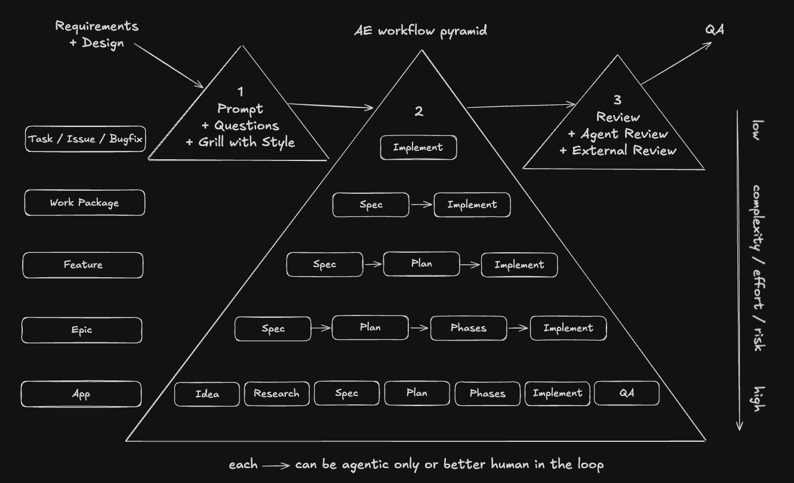

# Human-in-the-Loop Workflows

Agentic work gets safer when the workflow matches the size of the work. A tiny bugfix does not
need the same ceremony as a new app, but every level still needs the same outer guardrails:

1. [Prompt](03-PROMPTING.md), optionally followed by questions, brainstorming, or a grilling session
2. Workflow depending on complexity
3. [Review(s)](04-REVIEWING.md), including commit(s)

These are **human-in-the-loop** workflows: the agent drafts and implements, but a human checks
every step boundary. You review the spec before the plan, approve the plan before implementation,
gate each phase before the next one starts, and own the final review and commit. The agent never
crosses a boundary on its own.

The pyramid below is the decision model. Move down the pyramid as scope grows and the cost of a
wrong assumption rises. This pyramid lives inside the implementation phase of a typical software
development lifecycle (SDLC); it could be extended to include other phases, such as Design or QA,
but those are outside this guide because the focus here is implementation workflows. Note that the
QA step in the App workflow below is not that separate SDLC phase – it is a lightweight
verification pass that we consider part of the implementation phase here.



Requirements and design enter on the left and QA leaves on the right: those are the adjacent SDLC
phases. The external review in the last triangle is a second reviewer outside the agent session, a
colleague or another model. The footer already hints at the alternative to this chapter: each arrow
can also run agent-only, which is the subject of the autonomous workflows chapter. Here, every arrow
is a human checkpoint.

## Table of Contents

- [The workflow invariant](#the-workflow-invariant)
- [Workflow levels](#workflow-levels)
- [Choose checkpoints by risk](#choose-checkpoints-by-risk)
- [Human and agent responsibilities](#human-and-agent-responsibilities)
- [Parallelizing with Git worktrees](#parallelizing-with-git-worktrees)
- [Conclusion](#conclusion)
- [Using this in the workshop](#using-this-in-the-workshop)

## The Workflow Invariant

Every workflow starts with a prompt. For small, obvious work, that prompt can be direct. For
ambiguous or high-impact work, add grilling before implementation – with the
[`grill-me`](.agents/skills/grill-me/SKILL.md) or
[`grill-with-style`](.agents/skills/grill-with-style/SKILL.md) skills – so the agent challenges
the scope, terminology, risks, and expected outcome before it edits anything. The three prompting
levels are covered in [`03-PROMPTING.md`](03-PROMPTING.md).

Every workflow ends with review. The agent can prepare the diff and explain the tradeoffs – and
the [`code-review`](.agents/skills/code-review/SKILL.md) skill can dispatch an independent
reviewer – but the human owns the final judgment and the commit. For phased work, that means
review and commit at each phase boundary, not one large commit at the end. The review practice is
covered in [`04-REVIEWING.md`](04-REVIEWING.md).

## Workflow Levels

| Level                 | Use it for                                            | Workflow                                                                                                                    |
| --------------------- | ----------------------------------------------------- | --------------------------------------------------------------------------------------------------------------------------- |
| Task / issue / bugfix | Small, local, low-ambiguity work                      | Prompt and optionally grilling -> Implement -> Review including commit                                                      |
| Work package          | A bounded change where the outcome needs a short spec | Prompt and optionally grilling -> Spec -> Implement -> Review including commit                                              |
| Feature               | User-visible behavior with meaningful design choices  | Prompt and optionally grilling -> Spec -> Plan -> Implement -> Review including commit                                      |
| Epic                  | Multiple related features or risky cross-cutting work | Prompt and optionally grilling -> Spec -> Plan -> Phases -> Implement -> Review including commits                           |
| App                   | A new product or standalone application               | Prompt and optionally grilling -> Idea -> Research -> Spec -> Plan -> Phases -> Implement -> QA -> Review including commits |

Every arrow in that table is a human checkpoint. A spec is not "done" when the agent writes it;
it is done when you have read it and corrected it. The same holds for the plan, for each phase,
and for the final diff. The deeper the level, the more checkpoints – that is the point: more
scope means more opportunities for a wrong assumption, so you buy more places to catch one early.

## Choose Checkpoints by Risk

Size is a starting point, not the decision. Before choosing a level, ask what is uncertain, who is
affected, whether a mistake is reversible, how strongly checks cover the result, and which other
changes it depends on.

| Request                       | Risk that matters                                        | Suitable checkpoints                                                 |
| ----------------------------- | -------------------------------------------------------- | -------------------------------------------------------------------- |
| One-line authorization change | Small diff, expensive incorrect access                   | Explicit access cases, focused tests, security review                |
| Large official migration      | Broad diff, mostly deterministic, some unsupported cases | Scope approval, schematic output/TODO review, tests, bounded batches |
| Small empty-state change      | Unclear meaning of empty vs loading vs failure           | Short behavior spec, acceptance checks, UI review                    |

Exercise: choose a workflow for each row before revealing the last column. Explain which checkpoint
you would remove if the uncertainty were resolved, and what evidence would allow that.

The goal is to justify the gates. More documents are useful only when they answer different questions.
See the [worked feature](labs/cases/feature/SPEC.md) and its plan, decision record and change exercise.

## Human and Agent Responsibilities

The agent is useful at drafting specs, turning plans into implementation steps, writing code,
running checks, and summarizing diffs. The human is responsible for picking the right workflow
level, approving the spec and plan, deciding when a phase is complete, and committing reviewed
work.

Do not add process for its own sake. Add process when it protects you from expensive
misunderstandings:

- Use the top workflow when the desired change is already obvious.
- Add a spec when the outcome needs to be written down before code.
- Add a plan when sequencing matters.
- Add phases when one reviewable diff would be too large.
- Add research and QA when you are creating an app from scratch.

## Parallelizing with Git Worktrees

A single agent run can take ten or twenty minutes, and waiting idle for it is a waste. The next
productivity step is running several agents at once on independent tasks. Pointing them all at the
same working directory is fragile: they share the same files and Git index. The clean answer is
**Git worktrees**: each agent gets its own checkout of the repository, on its own branch, in its own
directory. The worktrees share the same repository data, so they are cheap to create – no second
clone – while avoiding filesystem and index collisions.

Parallelism does not change the model: you are still in the loop for every task, just for several
tasks at once. Each worktree runs its own prompt-to-review cycle, and you rotate between them at
the checkpoints.

### Creating a worktree per task

Create each task from your current integration branch, with its own branch name and sibling
directory:

```bash
# from the main repository
git worktree add ../ng-agentic-worktree-task-a -b feature/task-a
git worktree list   # inspect them anytime
```

Then start one agent per worktree. Setup that lives inside the checkout – dependencies, generated
files, a local `.env` – must be done once in each new directory: run `pnpm install` there, or symlink the
main checkout's `node_modules` into it as this repository's `AGENTS.md` prescribes. Pick tasks that
are genuinely independent: worktrees remove the _filesystem_ collision, but two agents editing the
same code still produce conflicting diffs that cancel out the time you saved.

### Bringing finished work back

The invariant still holds: review the diff and commit inside each worktree before integrating it.
Then merge into your development branch from the main checkout, one branch at a time. Re-run your
checks after each merge so a problem is attributable to a single task:

```bash
# from the main repository, on your development branch
git merge feature/task-a
```

Once a branch is merged, clean up its worktree and branch. The lowercase `-d` is intentional: Git
refuses to delete the branch if it still contains unmerged work.

```bash
git worktree remove ../ng-agentic-worktree-task-a
git branch -d feature/task-a
```

Use `git worktree prune` only when you deleted a worktree directory by hand and need Git to forget
the stale entry.

You rarely have to run these commands yourself – the agent can create, manage, and tear down its
own worktree on request, so this is mostly about understanding the model.

Parallelism adds overhead – more diffs to review and integrate – so it pays off only with several
genuinely independent tasks. For a single small task or tightly coupled work, one agent on one
branch is simpler and usually faster.

## Conclusion

There is no single correct workflow – only the one that fits the work in front of you. The pyramid
is a dial, not a checklist: start at the top, and add a spec, a plan, phases, or research only when
the cost of a wrong assumption justifies the extra ceremony. Too little process and the agent guesses
at scope; too much and you pay for documents nobody needed.

What never changes is the invariant. Every workflow opens with a prompt – sharpened by questions or
grilling when the work is ambiguous – and closes with human review and a commit. Worktrees change
_how many_ of these loops run at once, but they never remove the bookend: you still own the final
judgment on every diff, at every checkpoint in between.

Match the workflow to the scope, keep the guardrails on, and let the agent do the rest.

The deeper pyramid levels are not unique to this workshop – the ecosystem has started packaging
them into ready-made frameworks. [GitHub Spec Kit](https://github.com/github/spec-kit) turns the
Spec → Plan → Phases sequence into slash commands (`/speckit.specify`, `/speckit.plan`,
`/speckit.tasks`, `/speckit.implement`) behind a project constitution, and works with more than thirty
coding agents (Codex invokes them as `$speckit-*` skills). The [BMAD Method](https://docs.bmad-method.org/)
goes a step further and staffs the levels with dedicated agent personas – analyst, product manager,
architect, UX designer, developer – whose skills produce documents the next skill consumes. Both are
the same invariant with more ceremony, as long as you keep the gates on: each artifact can pass a
human checkpoint, but BMAD also offers an unattended build unit, so the choice to gate stays yours.
Consider them when a team wants a shared, tool-enforced process instead of every developer dialing
the pyramid by hand; for work the top of the pyramid already covers, they are overhead.

When the work is well-bounded and machine-verifiable, you can loosen the loop and let the agent
continue without a prompt at every boundary – that mode has its own guide in
[`06-AUTONOMOUS-WORKFLOWS.md`](06-AUTONOMOUS-WORKFLOWS.md).

## Using This in the Workshop

Work through [Lab 05 – Human-in-the-Loop Workflows](labs/05-hitl-workflows.html) after you have
completed the setup, skills, prompting, and reviewing labs. Use the project you chose in
[Lab 00](labs/00-getting-started.html) for the required assignments whenever possible. Only fall
back to this repository when you do not have a suitable task or feature in your own project.
