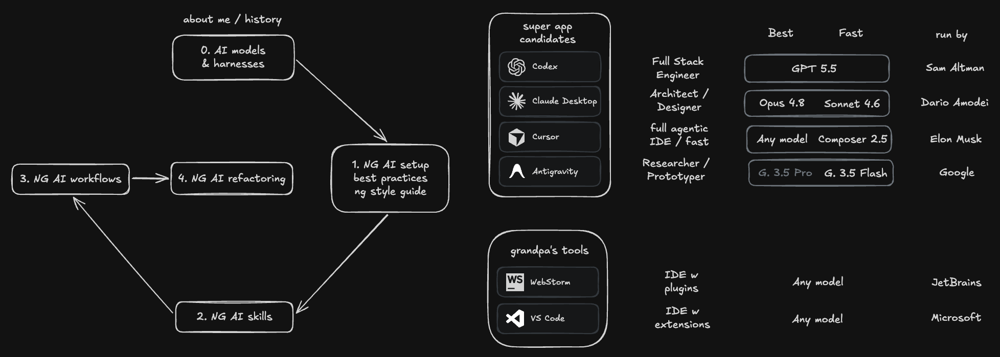

# NG Agentic Engineering



This sketch outlines the Agentic Engineering workshop arc: choosing AI models and harnesses, setting up an Angular AI workspace with best practices and style guides, building reusable AI skills, applying AI supported workflows, and using those foundations for targeted Angular refactoring. It connects directly to my recent [Agentic Engineering blog post series](https://www.angulararchitects.io/blog/best-llms-for-angular/), where I walk through the model choices, app and harness tradeoffs, costs, data privacy questions, and final setup recommendations behind the workshop.

A practical Angular workspace starter with modern best practices, AI-ready tooling, and scalable project setup guidance.

This project was generated using [Angular CLI](https://github.com/angular/angular-cli) version 22.0.0 on June 6th, 2026.

## Generate a new project with the CLI

To start we've created a new Angular project using the `ng new` command:

```shell
ng new ng-agentic
```

This sets up the basic structure of your Angular application, including configuration files, dependencies, and a simple starter component. It also initializes a Git repository for version control.

### fix initial commit

We fixed the initial commit by removing unnecessary duplications of the `AGENTS.md` instructions and running the following command:

```
pnpm format
```

which then executes:

```aiignore
prettier --write .
```

To avoid doing this manually every time, we can set up a pre-commit hook using Husky to automatically run the formatter before each commit.

## Install & setup Husky

### Install Husky

```shell
pnpm add -D husky
```

### Initialize Husky

```shell
pnpm exec husky init
```

### Update .husky/pre-commit

```shell
pnpm format
```

## Install Angular ESLint

To ensure code quality and consistency, we install Angular ESLint in our project. This tool helps us identify and fix issues in our TypeScript code according to best practices.

```shell
ng add @angular-eslint/schematics
```

This way, we can maintain code quality without having to remember to run the command manually.

### Lint-staged

We configured Angular ESLint to run as part of our development workflow, ensuring that any new code adheres to our coding standards before it's committed to the repository.

```shell
pnpm add -D lint-staged
```

In our `package.json`, we added the following configuration to run ESLint on staged files:

```json
{
  "lint-staged": {
    "*.{html,js,ts}": ["eslint --fix", "prettier --write"],
    "*.{css,json,md,scss}": ["prettier --write"]
  }
}
```

We updated our Husky pre-commit hook to run lint-staged:

```shell
pnpm lint-staged
```

### Extend ESLint configuration

By adding more rules to our flat ESLint configuration in `eslint.config.js`, we can enforce better
coding practices and catch potential issues early. Look at `eslint.config.js` to see my
recommendations.

To apply the new ESLint rules, we can run the following command:

```shell
ng lint --fix
```

There are two remaining issues that we need to fix manually:

```text
/Users/lxt/ng/ng-agentic/src/app/app.ts
  4:1  warning  The component's `changeDetection` value should be set to `ChangeDetectionStrategy.OnPush`  @angular-eslint/prefer-on-push-component-change-detection

/Users/lxt/ng/ng-agentic/src/main.server.ts
  5:47  error  Missing return type on function  @typescript-eslint/explicit-function-return-type
```

Because these are mechanical fixes, we can ask `codex` or another agent to make them for us.

## Angular Coding Style Guide

Find our [Angular Coding Style Guide](style-guide/style-guide.md) in the `style-guide` folder.

It contains general guidelines for writing clean and maintainable code in Angular projects, as well as specific style guides for different file types such as Git commits, HTML templates, NPM packages, SCSS styling files, and TypeScript files.

Anyone who copies and pastes this style guide should replace the `lxt-` class-name prefix with a prefix that is meaningful for her or his own app.

## Opinionated Agent Instructions

This commit turns `AGENTS.md` from a generic Angular guidance file into a repo specific operating contract for AI agents, adding workflow rules for preserving user edits, loading only the narrowest relevant style guides, applying modern Angular v22+ defaults, keeping TypeScript strict, and respecting template, accessibility, service, and testing boundaries.

## Finish the AI Setup

In the last commit we wrapped up the agentic tooling so every AI tool – Claude Code, Codex, Cursor, Cline, Junie, Gemini, Windsurf, GitHub Copilot and VS Code – works from the same conventions and the same servers:

- **Hardened `.aiignore`** so agents never read secrets, credentials or environment files (`.env`, `*.pem`, `*.key`, Angular `environment*.ts`, etc.).
- **Registered MCP servers** in `.mcp.json` (Angular CLI, Spartan UI, Chrome DevTools, Figma and
  Figma Desktop) and mirrored them into the tool-specific locations that don't read the root file:
  `.vscode/mcp.json`, `.junie/mcp/mcp.json` and `.codex/config.toml`.
- **Added thin per-agent files** (`.cursorrules`, `.clinerules`, `.junie/AGENTS.md`, `.gemini/GEMINI.md`, `.windsurf/rules/guidelines.md`, `.github/copilot-instructions.md`) that defer to `AGENTS.md`, plus `.claude/settings.json` to enable the project MCP servers.
- **Renamed `.prettierrc` to `.prettierrc.json`** and added an `ng:update` script to `package.json` for upgrading Angular.

## Feedback Loops

Agentic feature work is strongest when every change is checked against fast, concrete feedback from the application.
The core agent-facing expectations behind these loops are also captured in [AGENTS.md](AGENTS.md), including lint and static verification, serving ownership, Chrome debugging, and test setup boundaries.

### Linting

Linting turns the project's static rules into immediate feedback for an agent by catching style, accessibility, and TypeScript issues before runtime. Run `npx nx lint <project>` or the repo's lint script and feed any diagnostics back into the next agent prompt.

### Building

A build verifies that the full Angular graph still compiles and that strict TypeScript, templates, imports, and bundling remain valid. When `ng build` or the project build target fails, the error output gives the agent exact files and symbols to fix.

### Serving

Serving the app creates the live feedback loop for manual checks, browser inspection, and debugging. I prefer to start and stop the dev server myself in a terminal so I keep full control of the running process, and agents should use the already-running app instead of starting it for me.

### Chrome Debugger

Some tools, including Codex, provide an internal browser that agents can use for debugging browser state, console errors, network traffic, and interaction bugs. I still prefer running Chrome in debugging mode for this feedback loop: start Chrome with a remote debugging port – the [Chrome DevTools remote debugging docs](https://developer.chrome.com/docs/devtools/remote-debugging/local-server) explain the setup in more detail – for example `open -na "Google Chrome" --args --remote-debugging-port=9222 --user-data-dir=/tmp/chrome-agent-debug` – then connect Chrome DevTools or an agent browser tool to `http://localhost:9222`.

### E2E Testing

E2E tests exercise real user flows in the browser, so they catch integration and interaction bugs that linting and builds miss. When a Playwright or Cypress run fails, screenshots, traces, logs, and failure messages become focused feedback that an agent can use to repair the feature.

With that in place, the setup is ready to take for a spin – see [Step 10 (review & experiment)](labs/01-setup.html#s10) of the hands-on lab.

## Hands-on Labs

The workshop labs are designed to be applied to your own Angular workspace, not just this
repository:

- [Lab 00 – Getting Started](labs/00-getting-started.html): install this workspace, verify the
  toolchain, and choose the project you will carry through the workshop.
- [Lab 01 – Set up an Angular project for Agentic Engineering](labs/01-setup.html): recreate this
  workspace's agentic setup in your own project.
