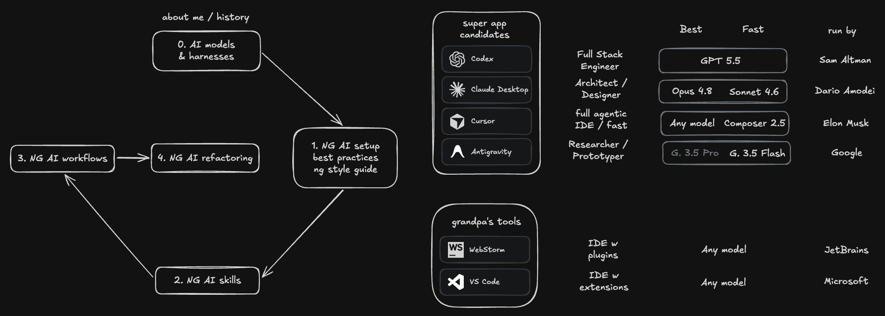

# NG Agentic Engineering



This sketch outlines the Agentic Engineering workshop arc: choosing AI models and harnesses, setting up an Angular AI workspace with best practices and style guides, building reusable AI skills, mastering prompting and reviewing – the two bookends of every agentic loop – applying AI-supported workflows – with a human in the loop or fully autonomous – using those foundations for targeted Angular refactoring, and closing with an outlook: what agentic engineering costs, how it scales to teams and monorepos, and where it is heading. The workshop intro slides are available in [AE-intro.pdf](AE-intro.pdf). It connects directly to my recent [Agentic Engineering blog post series](https://www.angulararchitects.io/blog/best-llms-for-angular/), where I walk through the model choices, app and harness tradeoffs, costs, data privacy questions, and final setup recommendations behind the workshop.

A practical Angular workspace starter with modern best practices, AI-ready tooling, and scalable project setup guidance.

This project was generated using [Angular CLI](https://github.com/angular/angular-cli) version 22.0.0 on June 6th, 2026.

## Workshop entry point

Start with [Lab 00](labs/00-getting-started.html) and the required path in
[Lab 01](labs/01-setup.html). [WORKSHOP.md](WORKSHOP.md) explains the chapter checkpoints and
delivery record; [VERIFICATION.md](VERIFICATION.md) defines the checks used throughout.
The commands below also document how this repository was built, commit by commit.

## Generate a new project with the CLI

To start we've created a new Angular project using the `ng new` command:

```shell
ng new ng-agentic
```

This sets up the basic structure of your Angular application, including configuration files, dependencies, and a simple starter component. It also initializes a Git repository for version control.

### Fix initial commit

We fixed the initial commit by removing unnecessary duplications of the `AGENTS.md` instructions and running the following command:

```shell
pnpm format
```

which then executes:

```shell
prettier --write .
```

To avoid doing this manually every time, we can set up a pre-commit hook using Husky to automatically run the formatter before each commit.

## Install & setup Husky

### Install Husky

```shell
pnpm add -D husky
```

### Initialize Husky

```shell
pnpm exec husky init
```

### Update .husky/pre-commit

```shell
pnpm format
```

## Install Angular ESLint

To ensure code quality and consistency, we install Angular ESLint in our project. This tool helps us identify and fix issues in our TypeScript code according to best practices.

Our pre-commit hook only runs the formatter so far, so we add Angular ESLint with the following command:

```shell
ng add angular-eslint
```

Besides the `angular-eslint` package itself this also registers the `angular-eslint` schematic collection in `angular.json` and pins `@angular-eslint/builder` as an explicit devDependency, so the lint builder resolves reliably under pnpm.

### Lint-staged

We configured Angular ESLint to run as part of our development workflow, ensuring that any new code adheres to our coding standards before it's committed to the repository.

```shell
pnpm add -D lint-staged
```

In our `package.json`, we added the following configuration to run ESLint on staged files:

```json
{
  "lint-staged": {
    "*.{html,js,ts}": ["eslint --fix", "prettier --write"],
    "*.{css,json,md,scss}": ["prettier --write"]
  }
}
```

We updated our Husky pre-commit hook to run lint-staged:

```shell
pnpm exec lint-staged
```

This way, we can maintain code quality without having to remember to run the commands manually.

### Extend ESLint configuration

By adding more rules to our flat ESLint configuration in `eslint.config.js`, we can enforce better
coding practices and catch potential issues early. Look at `eslint.config.js` to see my
recommendations.

To apply the new ESLint rules, we can run the following command:

```shell
ng lint --fix
```

There are two remaining issues that we need to fix manually:

```text
/Users/lxt/ng/ng-agentic/src/app/app.ts
  4:1  warning  The component's `changeDetection` value should be set to `ChangeDetectionStrategy.OnPush`  @angular-eslint/prefer-on-push-component-change-detection

/Users/lxt/ng/ng-agentic/src/main.server.ts
  5:47  error  Missing return type on function  @typescript-eslint/explicit-function-return-type
```

Because these are mechanical fixes, we can ask `codex` or another agent to make them for us.

## Angular Coding Style Guide

Find our [Angular Coding Style Guide](style-guide/style-guide.md) in the `style-guide` folder.

It contains general guidelines for writing clean and maintainable code in Angular projects, as well as specific style guides for different file types such as Git commits, HTML templates, NPM packages, SCSS styling files, and TypeScript files.

Anyone who copies and pastes this style guide should replace the `lxt-` class-name prefix with a prefix that is meaningful for her or his own app.

## Opinionated Agent Instructions

This commit turns `AGENTS.md` from a generic Angular guidance file into a repo specific operating contract for AI agents, adding workflow rules for preserving user edits, loading only the narrowest relevant style guides, applying modern Angular v22+ defaults, keeping TypeScript strict, and respecting template, accessibility, service, and testing boundaries.

Two things to keep in mind when adopting these instructions:

- **They are tuned for a specific model generation.** This `AGENTS.md` was developed and tested against Opus 4.5 to Opus 4.8 and GPT-5.2 to GPT-5.5. Now that the next, more intelligent generation has arrived – Fable 5.1, GPT-5.6 – that reevaluation is due: check whether the detailed instructions on Angular and TypeScript best practices are still necessary to get high-quality code output, or whether the newer models already internalize them. Treat this as a constantly evolving instruction set, not a finished artifact.
- **Less can be more.** Parts of the community argue that shorter instruction files outperform long ones, because every rule competes for the model's attention. So don't copy this file verbatim – play around with the instructions, measure what actually changes your output quality, and fine-tune them for your own projects and workflows.

## Finish the AI Setup

In the last commit we wrapped up the agentic tooling so every AI tool – Claude Code, Codex, Cursor, Cline, Junie, Gemini, Windsurf, GitHub Copilot and VS Code – works from the same conventions and the same servers:

- **Reduced accidental secret reads per tool** – there's no cross-vendor ignore standard yet, so
  configure each tool deliberately. Claude Code's `permissions.deny` rules guard its built-in file
  tools but may not cover shell commands. Codex's `no-secrets` filesystem profile applies its deny
  patterns across filesystem access, including shell commands, when that profile is active. Neither
  mechanism is a complete security boundary. Verify the configured behavior with a harmless fixture,
  keep real secrets outside the checkout, use sandboxing for filesystem isolation, constrain shell
  access for unattended runs, and prefer short-lived, scoped credentials.
- **Registered MCP servers** in `.mcp.json` (Angular CLI, Spartan UI, Chrome DevTools, Figma and
  Figma Desktop) and mirrored them into the tool-specific locations that don't read the root file:
  `.vscode/mcp.json`, `.junie/mcp/mcp.json` and `.codex/config.toml`. These five servers are examples
  that fit this workspace – every team should curate its own set. Each MCP server costs context and
  trust, so only register servers that earn their place in your project.
- **Added thin per-agent files** (`.cursorrules`, `.clinerules`, `.junie/AGENTS.md`, `.gemini/GEMINI.md`, `.windsurf/rules/guidelines.md`, `.github/copilot-instructions.md`) that defer to `AGENTS.md`, plus `.claude/settings.json` to enable the project MCP servers.
- **Renamed `.prettierrc` to `.prettierrc.json`** and added an `ng:update` script to `package.json` for upgrading Angular.

## Feedback Loops

Agentic feature work is strongest when every change is checked against fast, concrete feedback from the application.
The core agent-facing expectations behind these loops are also captured in [AGENTS.md](AGENTS.md), including lint and static verification, serving ownership, Chrome debugging, and test setup boundaries.

### Linting

Linting turns the project's static rules into immediate feedback for an agent by catching style, accessibility, and TypeScript issues before runtime. Run `ng lint` or the repo's lint script and feed any diagnostics back into the next agent prompt.

### Building

A build verifies that the full Angular graph still compiles and that strict TypeScript, templates, imports, and bundling remain valid. When `ng build` or the project build target fails, the error output gives the agent exact files and symbols to fix.

### Serving

Serving the app creates the live feedback loop for manual checks, browser inspection, and debugging. I prefer to start and stop the dev server myself in a terminal so I keep full control of the running process, and agents should use the already-running app instead of starting it for me.

### Chrome Debugger

Some tools, including Codex, provide an internal browser that agents can use for debugging browser state, console errors, network traffic, and interaction bugs. I still prefer running Chrome in debugging mode for this feedback loop: start Chrome with a remote debugging port – the [Chrome DevTools remote debugging docs](https://developer.chrome.com/docs/devtools/remote-debugging/local-server) explain the setup in more detail – for example `open -na "Google Chrome" --args --remote-debugging-port=9222 --user-data-dir=/tmp/chrome-agent-debug` – then connect Chrome DevTools or an agent browser tool to `http://localhost:9222`.

### E2E Testing

E2E tests exercise real user flows in the browser, so they catch integration and interaction bugs that linting and builds miss. When a Playwright or Cypress run fails, screenshots, traces, logs, and failure messages become focused feedback that an agent can use to repair the feature.

With that in place, the setup is ready to take for a spin – see [Step 8 (take it for a spin: validate the setup)](labs/01-setup.html#s8) of the hands-on lab.

## Recommended AI Companion Apps

Agentic work changes what you do all day: less typing code, more talking to agents, reviewing diffs, and shuttling context between apps. These eight companion apps support exactly that. None of the links below are referral links, just my pure recommendations – the only exception is the Wispr Flow link, and that one is written out so you can see it.

### Optional companion apps

#### Wispr Flow

Wispr Flow is a system-wide voice dictation app – you speak, it types into whatever app has focus. Prompting agents is much faster when you talk instead of type. Stop pretending it's still 2025. ☺ Get a free month via <https://wisprflow.ai/r?ALEXANDER14084> – yes, that's a referral link, but a really good one.

#### Git GUI

A Git GUI makes it easy to review agent-generated changes, stage them selectively, and switch branches – especially if you otherwise live in VS Code. Look at the [Git GUI overview](https://git-scm.com/tools/guis) or use [Fork](https://fork.dev).

#### Ghostty or WezTerm

We preferably drive agents from super apps like Codex, Claude Desktop, Cursor, or even T3 Code – but for the CLI moments that remain, a modern terminal like [Ghostty](https://ghostty.org) (mac) or [WezTerm](https://wezterm.org) (cross-platform) is worth it.

#### Clipboard History Manager

You constantly shuttle prompts, snippets, and screenshots between agents, editors, and browsers. [Raycast](https://raycast.com) (mac) or [Ditto](https://ditto-cp.sourceforge.io) (win) make sure you never lose one to the next copy.

### More optional tools

#### GitHub CLI

Agents lean on the [GitHub CLI](https://cli.github.com) (`gh`) for creating pull requests, reading issues, and checking CI – install it once and every agent can use it.

#### Screenshot Tool

Screenshots are the fastest way to hand visual context – broken layouts, design references, error dialogs – to an agent. Use e.g. [Shottr](https://shottr.cc) (mac) or [ShareX](https://getsharex.com) (win).

#### Markdown WYSIWYG Editor

Agentic workflows produce a lot of Markdown – plans, reviews, docs like this one. [Typora](https://typora.io) (cross-platform) makes editing them pleasant.

#### Window Manager / Split Screen Helper

Agent, editor, and browser side by side is the standard layout – [Rectangle](https://rectangleapp.com) (mac) or [FancyZones](https://learn.microsoft.com/en-us/windows/powertoys/fancyzones) (win, part of PowerToys) get you there with one shortcut.

## Angular Skills

Beyond the shared conventions, this workspace ships a library of **agent skills** under
`.agents/skills/` – focused, reusable capabilities an AI agent can invoke for Angular work
(signal forms, data access, SignalStore state, migrations, refactoring, accessibility,
performance and security reviews, prototyping, unit and e2e tests, verifying a feature in the
browser) and for the agentic process itself (skill authoring, brainstorming and grilling, plan
execution, test-driven development, bug diagnosis, code review, prose de-slopping, handover, git
stack rewrites). Each skill is a folder with a `SKILL.md` plus optional `references/`,
`scripts/`, or `assets/` support files loaded just in time, split into **custom** skills
authored here (MIT-licensed) and **third-party** skills adapted from public sources with their
origins and local adaptations recorded.

See [`02-SKILLS.md`](02-SKILLS.md) for the full directory – every skill with a one-line description,
grouped into custom and third-party.

## Prompting & Context

Skills give the agent repeatable processes; the prompt decides which process runs and against
what understanding. [`03-PROMPTING.md`](03-PROMPTING.md) covers the anatomy of a good prompt –
observation, goal, constraints, scope, check – and the three levels used throughout this
workshop: the **simple prompt**, the **interactive prompt** where the agent asks you clarifying
questions one at a time, and the **intense session** driven by the
[`grill-me`](.agents/skills/grill-me/SKILL.md),
[`grill-with-style`](.agents/skills/grill-with-style/SKILL.md), or
[`brainstorming`](.agents/skills/brainstorming/SKILL.md) skills. It also covers managing the
session itself – treating the context window as a budget, preferring one task per session, and
carrying work across sessions with the [`handover`](.agents/skills/handover/SKILL.md) skill.

Practice up to three levels on your own project in
[Lab 03 – Prompting & Context](labs/03-prompting.html).

## Reviewing

The prompt opens the loop; review closes it. The agent can prepare the diff and explain the
tradeoffs, but the human owns the final judgment – and, in this workshop's default flow, the
commit. [`04-REVIEWING.md`](04-REVIEWING.md)
covers the practice: let the feedback loops go first, pick an explicit review scope, run the two
passes (correctness against requirements, then style-guide conformance), dispatch an independent
reviewer with the [`code-review`](.agents/skills/code-review/SKILL.md) skill, and act on findings
by severity – verifying each one before touching the code.

Review a real diff end-to-end in [Lab 04 – Reviewing](labs/04-reviewing.html).

## Human-in-the-Loop Workflows

Prompting opens the loop and reviewing closes it; workflows decide how much structure belongs
between those bookends before an agent starts editing. The workflow pyramid in
[`05-HITL-WORKFLOWS.md`](05-HITL-WORKFLOWS.md) – illustrated in
[`05-HITL-WORKFLOWS.png`](05-HITL-WORKFLOWS.png) – is the decision model: every level starts with a
[prompt](03-PROMPTING.md) and optional grilling, then adds the right middle steps for the size of the
work, and ends with [review](04-REVIEWING.md) including the user commit or commits. The human stays
in the loop throughout: every spec, plan, phase, and diff passes your review before the agent
continues.

Practice that decision in [Lab 05 – Human-in-the-Loop Workflows](labs/05-hitl-workflows.html).

## Autonomous Workflows

The opposite mode is working **away from keyboard**:
[`06-AUTONOMOUS-WORKFLOWS.md`](06-AUTONOMOUS-WORKFLOWS.md) covers the autonomy ladder – goal-driven runs
that iterate until a verifiable condition holds, recurring loops that babysit CI and PRs,
orchestrators that fan work out to subagents, and always-on agents running 24/7 on a dedicated
machine with systems like OpenClaw or Hermes. Autonomy is earned by verifiability: it needs a
checkable definition of done, feedback signals inside the run, and guardrails – and the review
invariant is only deferred, never waived.

Climb the ladder in [Lab 06 – Autonomous Workflows](labs/06-autonomous-workflows.html).

## Refactoring Angular

Turning a dusty, legacy component into modern, signal-based Angular has its own playbook in
[`07-REFACTORING.md`](07-REFACTORING.md): a repeatable **7-step blueprint** – Analyse → Declutter →
Update → Modernize → Type → Refactor → Review – wrapped in AI guardrails and a verify-every-step
gauntlet (build → lint → format → test); step 3, Update, runs once per workspace, not per
component. It is driven by the
[`ng-refactor`](.agents/skills/ng-refactor/SKILL.md) skill (which pairs with
[`ng-migrate`](.agents/skills/ng-migrate/SKILL.md) for the official migration schematics), and you
can work it end-to-end on a real component in
[Lab 07 – Refactoring a Dusty Angular Component](labs/07-refactoring.html).

The fallback table feature in this workspace intentionally carries lint debt for the refactoring
exercise; record that red baseline before changing production code. The intentional debt extends
to the workspace shell: the app deliberately runs zone-based change detection (an explicit,
documented exception to [`AGENTS.md`](AGENTS.md)'s zoneless rule) and relaxed build budgets in
`angular.json` to host the legacy table. The legacy table components are explicitly pinned to
`ChangeDetectionStrategy.Eager` – the v22 name for the former default semantics, and what `ng update`
pins on migrated legacy components. The exercise's core target is moving them to `OnPush`; restoring zoneless and
tightening the budgets is the bonus round, since legacy code usually depends on zone-driven
timing and only survives the jump to zoneless after OnPush and the signal migration have landed.

## Outlook

The closing module steps back from technique: [`08-OUTLOOK.md`](08-OUTLOOK.md) sums up the arc –
the harness where the repo is the prompt, the skills, the five-part prompt, the two review passes,
the pyramid, the ladder, and the blueprint, all held together by one invariant – and adds the
economics the other modules only touched: flat subscriptions vs. token pricing, evaluating model
configurations on your own acceptance cases, and spend caps before you climb the autonomy ladder,
with value measured in accepted outcomes – reviewed changes, correct diagnoses, justified rejections –
rather than tokens burned. From there it looks outward: bringing the setup
to your team as shared, PR-reviewed contracts, scaling it to Nx monorepos, what improving model
generations mean for your instruction files, and a first-week todo list.

Close the loop on your own project in [Lab 08 – Outlook](labs/08-outlook.html).

## Hands-on Labs

The workshop labs are designed to be applied to your own Angular workspace, not just this
repository. [Lab 00](labs/00-getting-started.html) is pre-work – finish it before the workshop
day so the sessions start with a working toolchain:

- [Lab 00 – Getting Started](labs/00-getting-started.html): install this workspace, verify the
  toolchain, and choose the project you will carry through the workshop.
- [Lab 01 – Set up an Angular project for Agentic Engineering](labs/01-setup.html): recreate this
  workspace's agentic setup in your own project.
- [Lab 02 – Agent Skills](labs/02-skills.html): use one or two skills on your own project, then
  create a custom skill for a repeatable process.
- [Lab 03 – Prompting & Context](labs/03-prompting.html): run the same task as a simple prompt,
  an interactive prompt, and a grilling session, and learn when each level pays off.
- [Lab 04 – Reviewing](labs/04-reviewing.html): gate a real diff through the feedback loops, run
  an independent agent review, and act on the findings by severity.
- [Lab 05 – Human-in-the-Loop Workflows](labs/05-hitl-workflows.html): choose the right workflow
  for tasks, features, and app-sized work – and gate every step of it.
- [Lab 06 – Autonomous Workflows](labs/06-autonomous-workflows.html): run a goal-driven session, then a
  recurring loop or an orchestrated fan-out unattended, and review the accumulated diff.
- [Lab 07 – Refactoring a Dusty Angular Component](labs/07-refactoring.html): run the 30-minute
  booking-summary exercise in this workspace, then use the `ng-refactor` skill on your own legacy
  codebase; the workspace's `src/app/components/table/` feature is the advanced continuation.
- [Lab 08 – Outlook](labs/08-outlook.html): close the workshop – hold your project against the
  Lab 00 goal, write your adoption plan, and decide your model and budget strategy.

Keep the [workshop cheat sheet](labs/cheat-sheet.html) at hand – one printable page with the
five prompt parts, the two review passes, the workflow pyramid, the autonomy ladder, the
7-step refactoring blueprint, and the first-week checklist.

## Keeping the Material Fresh

The agentic ecosystem moves faster than any workshop schedule, so give the material a freshness
pass before each delivery: re-check the external tools and links the modules cite (OpenClaw,
Hermes Agent, SkillSpector, the companion apps), re-run the capability check behind `/goal` and
`/loop` on the installed agents, and re-run [Lab 01's validation loop](labs/01-setup.html#s8) on the newest
model generation – [`08-OUTLOOK.md`](08-OUTLOOK.md#where-this-is-heading) explains how to evaluate instruction changes across models. The link and capability checks are bounded
enough for a [recurring loop](06-AUTONOMOUS-WORKFLOWS.md#recurring-loops) to report on; judging what a
newer model still needs stays a human pass.
