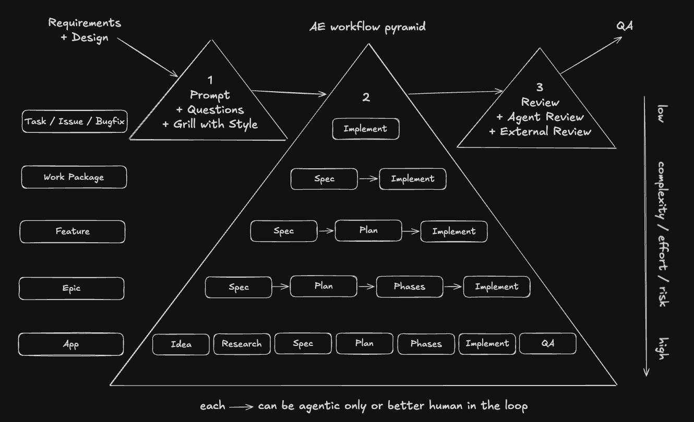

# Agentic Workflows

Agentic work gets safer when the workflow matches the size of the work. A tiny bugfix does not
need the same ceremony as a new app, but every level still needs the same outer guardrails:

1. Prompt, optionally followed by questions, brainstorming, or a grilling session
2. Workflow depending on complexity
3. Review(s), including commit(s)

The pyramid below is the decision model. Move down the pyramid as scope grows and the cost of a
wrong assumption rises. This pyramid lives inside the implementation phase of a typical software
development lifecycle (SDLC); it could be extended to include other phases, such as Design or QA,
but those are outside this guide because the focus here is implementation workflows.



## Table of Contents

- [The invariant](#the-invariant)
- [Workflow levels](#workflow-levels)
- [Human and agent responsibilities](#human-and-agent-responsibilities)
- [Parallelizing with Git worktrees](#parallelizing-with-git-worktrees)
- [Autonomous, away-from-keyboard workflows](#autonomous-away-from-keyboard-workflows)
- [Conclusion](#conclusion)
- [Using this in the workshop](#using-this-in-the-workshop)

## The Invariant

Every workflow starts with a prompt. For small, obvious work, that prompt can be direct. For
ambiguous or high-impact work, add grilling before implementation so the agent challenges the
scope, terminology, risks, and expected outcome before it edits anything.

Every workflow ends with review. The agent can prepare the diff and explain the tradeoffs, but the
human owns the final judgment and the commit. For phased work, that means review and commit at
each phase boundary, not one large commit at the end.

## Workflow Levels

| Level                 | Use it for                                            | Workflow                                                                                                                    |
| --------------------- | ----------------------------------------------------- | --------------------------------------------------------------------------------------------------------------------------- |
| Task / issue / bugfix | Small, local, low-ambiguity work                      | Prompt and optionally grilling -> Implement -> Review including commit                                                      |
| Work package          | A bounded change where the outcome needs a short spec | Prompt and optionally grilling -> Spec -> Implement -> Review including commit                                              |
| Feature               | User-visible behavior with meaningful design choices  | Prompt and optionally grilling -> Spec -> Plan -> Implement -> Review including commit                                      |
| Epic                  | Multiple related features or risky cross-cutting work | Prompt and optionally grilling -> Spec -> Plan -> Phases -> Implement -> Review including commits                           |
| App                   | A new product or standalone application               | Prompt and optionally grilling -> Idea -> Research -> Spec -> Plan -> Phases -> Implement -> QA -> Review including commits |

## Human and Agent Responsibilities

The agent is useful at drafting specs, turning plans into implementation steps, writing code,
running checks, and summarizing diffs. The human is responsible for picking the right workflow
level, approving the spec and plan, deciding when a phase is complete, and committing reviewed
work.

Do not add process for its own sake. Add process when it protects you from expensive
misunderstandings:

- Use the top workflow when the desired change is already obvious.
- Add a spec when the outcome needs to be written down before code.
- Add a plan when sequencing matters.
- Add phases when one reviewable diff would be too large.
- Add research and QA when you are creating an app from scratch.

## Parallelizing with Git Worktrees

A single agent run can take ten or twenty minutes, and waiting idle for it is a waste. The next
productivity step is running several agents at once on independent tasks. Pointing them all at the
same working directory is fragile: they share the same files and Git index. The clean answer is
**Git worktrees**: each agent gets its own checkout of the repository, on its own branch, in its own
directory. The worktrees share the same repository data, so they are cheap to create – no second
clone – while avoiding filesystem and index collisions.

### Creating a worktree per task

Create each task from your current integration branch, with its own branch name and sibling
directory:

```bash
# from the main repository
git worktree add ../ng-agentic-feature-a -b feature-a
git worktree list   # inspect them anytime
```

Then start one agent per worktree. Setup that lives inside the checkout – dependencies, generated
files, a local `.env` – must be done once in each new directory, e.g. `npm install`. Pick tasks that
are genuinely independent: worktrees remove the _filesystem_ collision, but two agents editing the
same code still produce conflicting diffs that cancel out the time you saved.

### Bringing finished work back

The invariant still holds: review the diff and commit inside each worktree before integrating it.
Then merge into your development branch from the main checkout, one branch at a time. Re-run your
checks after each merge so a problem is attributable to a single task:

```bash
# from the main repository, on your development branch
git merge feature-a
```

Once a branch is merged, clean up its worktree and branch. The lowercase `-d` is intentional: Git
refuses to delete the branch if it still contains unmerged work.

```bash
git worktree remove ../ng-agentic-feature-a
git branch -d feature-a
```

Use `git worktree prune` only when you deleted a worktree directory by hand and need Git to forget
the stale entry.

You rarely have to run these commands yourself – the agent can create, manage, and tear down its
own worktree on request, so this is mostly about understanding the model.

Parallelism adds overhead – more diffs to review and integrate – so it pays off only with several
genuinely independent tasks. For a single small task or tightly coupled work, one agent on one
branch is simpler and usually faster.

## Autonomous, Away-from-Keyboard Workflows

Everything above keeps a human in the loop at each boundary. The opposite mode is letting the agent
continue without a prompt at every step. In Claude Code, `/goal` is the fit for "keep working until
this verifiable condition is met"; `/loop` is better for recurring scheduled prompts, such as
checking CI, watching a deploy, or babysitting a PR. Other agents expose similar patterns.

Local autonomous modes are not durable background automation: they depend on the session, the local
machine, and the available tool permissions. For work that must survive a closed terminal, a
restart, or a sleeping laptop, use a cloud-hosted runner, CI schedule, managed routine, or another
agent platform that runs independently of your machine.

This trades supervision for throughput, and it only works when the agent can tell whether it is done
without you:

- A **verifiable goal**: a definition of done the agent can check itself – a passing test suite, a
  green build, a clean lint, a script that exits zero. "Make it nicer" is not something an
  unattended run can verify.
- A **feedback signal inside the run**: the checks run after each iteration are what turn autonomous
  work from "keep editing" into "edit until correct." Without them the agent has nothing to converge
  on.
- **Guardrails**: the agent must not be able to do irreversible damage while you are away. Keep it
  on a branch or worktree, deny push and destructive commands, constrain credentials, avoid
  production environment variables and services, and scope the task so a wrong turn stays contained.

The invariant is not waived, only deferred. The human review and commit still happen – at the end,
against the accumulated diff, rather than at each step. Treat the autonomous run's output as a draft to
review, never as already-approved work.

Autonomous runs pair naturally with [worktrees](#parallelizing-with-git-worktrees): start one
session per worktree and several goals progress unattended in parallel. Keep concurrency modest,
because those sessions still share ports, caches, external services, API quotas, and your review
capacity. Reserve the mode for well-bounded, well-tested work – the less verifiable the goal, the
more an autonomous run drifts, and the more time you spend untangling an unsupervised diff than you
would have spent supervising it.

## Conclusion

There is no single correct workflow – only the one that fits the work in front of you. The pyramid
is a dial, not a checklist: start at the top, and add a spec, a plan, phases, or research only when
the cost of a wrong assumption justifies the extra ceremony. Too little process and the agent guesses
at scope; too much and you pay for documents nobody needed.

What never changes is the invariant. Every workflow opens with a prompt – sharpened by questions or
grilling when the work is ambiguous – and closes with human review and a commit. Worktrees and
autonomous runs change _how many_ of these loops run at once and _how closely_ you watch each step,
but they never remove the bookend: you still own the final judgment on every diff.

Match the workflow to the scope, keep the guardrails on, and let the agent do the rest.

## Using This in the Workshop

Work through [Lab 03 – Workflows](labs/03-workflows.html) after you have completed the setup and
skills labs. Use the project you chose in [Lab 00](labs/00-getting-started.html) for the required
assignments whenever possible. Only fall back to this repository when you do not have a suitable
task or feature in your own project.
